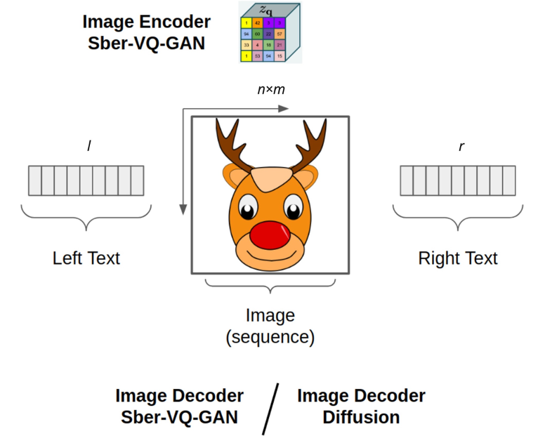
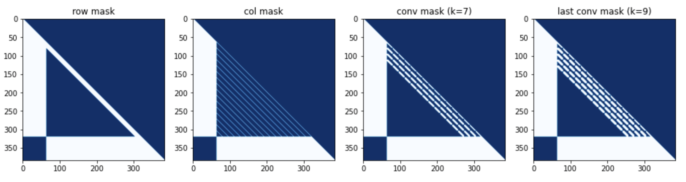
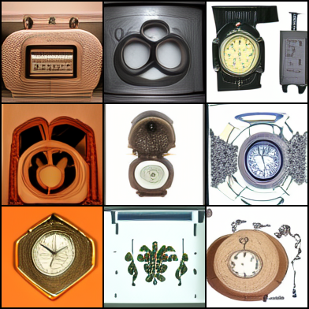
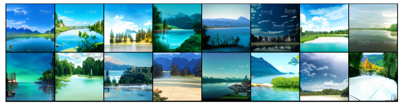
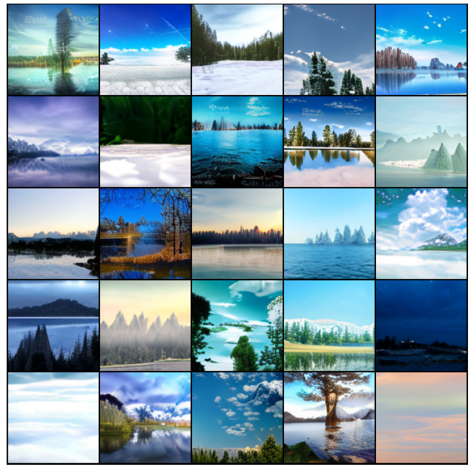
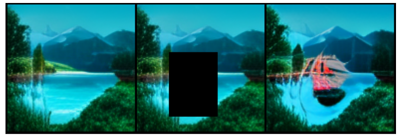
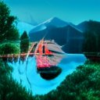
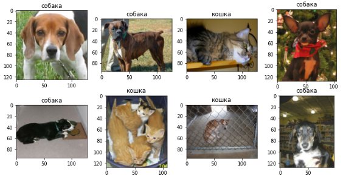

[[Paper]]() [[Хабр]]() [[Model Card]](https://huggingface.co/sberbank-ai/RuDOLPH-350M) [[Colab]](https://colab.research.google.com/drive/1gmTDA13u709OXiAeXWGm7sPixRhEJCga?usp=sharing) [[Kaggle]]()


##  RuDOLPH 🦌🎄☃️

*One Hyper-Modal Transformer can be creative as DALL-E and smart as CLIP*

---

**Ru**ssian **D**iffusion **O**n **L**anguage **P**icture **H**yper-modality (RuDOLPH) is a fast 
and light text-image-text transformer (350M GPT-3) designed for a quick and easy fine-tuning setup 
for the solution of various tasks: from generating images by text description and image classification 
to visual question answering and more. This model demonstrates the power of Hyper-modality Transformers.

*(!!!) Hyper-modality means generalized multi-modal, e.g., model that consists of two multi-modal parts: text-2-image and image-2-text becomes text and image hyper-modality model*




# Sparse Attention Mask
`row - col - row - [last] conv`



# Models
+ [350M (RuDOLPH)](https://huggingface.co/sberbank-ai/RuDOLPH-350M)
+ 1.3B (In Progress)
+ 4B (In Progress)


# Installing
```
pip install rudolph==0.0.1rc8
```

# Usage

Fine-Tuning example by [@Alex Wortega](https://github.com/AlexWortega) 
[](https://colab.research.google.com/drive/12YRRzhl5cHER_U2F-buQxif8GlhMPWq3?usp=sharing)

### Init models
```python
from rudalle import get_tokenizer, get_vae
from rudalle.utils import seed_everything
from rudalle.image_prompts import ImagePrompts

from rudolph.model import get_rudolph_model
from rudolph.pipelines import zs_clf, generate_codebooks, self_reranking_by_image, self_reranking_by_text, show, generate_captions, generate_texts
from rudolph import utils

device = 'cuda'
model = get_rudolph_model('350M', fp16=True, device=device)
model.to(device);
tokenizer = get_tokenizer()
vae = get_vae(dwt=False).to(device)
```

### Setup for Fast Image Generation

```python
text = 'старинный будильник многоугольной формы'
bs, images_num = 48, 48
top_k, top_p = 512, 0.9
with torch.no_grad():
    codebooks = generate_codebooks(text, tokenizer, model, top_k=top_k, images_num=images_num, top_p=top_p, bs=bs)
    ppl_text, ppl_image = self_reranking_by_text(text, codebooks, tokenizer, model, bs=bs)
    images = vae.decode(codebooks[ppl_text.argsort()[:4]])
images = torchvision.utils.make_grid(images, nrow=2)
img = torchvision.transforms.functional.to_pil_image(images)
img
```



### Text Generation
```python
generate_texts(
    tokenizer,
    model,
    template='красивый пейзаж ',
    top_k=32, top_p=0.8, texts_num=32, bs=32, seed=42
)[:8]

[{'text': 'красивый пейзаж и деревья в горах с синим небом и облаками в солнечный день. карпаты украина', 'ppl': 155.72},
 {'text': 'красивый пейзаж с горным озером и красивым пейзажем на восходе солнца', 'ppl': 195.81},
 {'text': 'красивый пейзаж с горными вершинами и чистым небом', 'ppl': 219.57},
 {'text': 'красивый пейзаж с горами в тумане, покрывающими горы', 'ppl': 221.36},
 {'text': 'красивый пейзаж и водопад в национальном парке пхутта в таиланде', 'ppl': 248.82},
 {'text': 'красивый пейзаж с голубым небом и белым облаком', 'ppl': 260.76},
 {'text': 'красивый пейзаж с рекой, горы и голубое небо', 'ppl': 273.1},
 {'text': 'красивый пейзаж с зелеными деревьями и голубым небом', 'ppl': 286.22}]
```

### Image Generation + Self Reranking
```python
text = 'красивый пейзаж с озером и лесом на заднем плане'
images_num, bs = 256, 32
seed_everything(42)
codebooks = []
for top_k, top_p, images_num in [
    (2048, 0.975, images_num),
    (1536, 0.975, images_num),
    (1024, 0.975, images_num),
]:
    codebooks.append(generate_codebooks(text, tokenizer, model, top_k=top_k, images_num=images_num, top_p=top_p, bs=bs))

codebooks = torch.cat(codebooks)

ppl_text, ppl_image = self_reranking_by_text(text, codebooks, tokenizer, model, bs=bs)
with torch.no_grad():
    images = vae.decode(codebooks[ppl_text.argsort()[:16]])

pil_images = utils.torch_tensors_to_pil_list(images)
show(pil_images, 8)
```



```python
text = 'зимнее время года'

ppl_text, ppl_image = self_reranking_by_text(text, codebooks, tokenizer, model, bs=32)
with torch.no_grad():
    images = vae.decode(codebooks[ppl_text.argsort()[:16]])

pil_images = utils.torch_tensors_to_pil_list(images)
show(pil_images, 8)
```



```python
text = 'ночное время суток'

ppl_text, ppl_image = self_reranking_by_text(text, codebooks, tokenizer, model, bs=32)
with torch.no_grad():
    images = vae.decode(codebooks[ppl_text.argsort()[:16]])

pil_images = utils.torch_tensors_to_pil_list(images)
show(pil_images, 8)
```


### Image Prompt (like Inpainting)

```python
text = 'лодка с алыми парусами'

images_num = 1024
bs = 32

borders = {'up': 6, 'left': 4, 'right': 6, 'down': 2}
image_prompts = ImagePrompts(pil_img, borders, vae, device, crop_first=True)

seed_everything(42)
codebooks = []
for top_k, top_p, images_num in [
    (1024, 0.99, images_num),
]:
    codebooks.append(
        generate_codebooks(text, tokenizer, model, top_k=top_k, images_num=images_num, top_p=top_p, bs=bs, image_prompts=image_prompts)
    )

codebooks = torch.cat(codebooks)

ppl_text, ppl_image = self_reranking_by_text(
    text,
    codebooks,
    tokenizer,
    model,
    bs=bs,
)
with torch.no_grad():
    images = vae.decode(codebooks[ppl_text.argsort()[:16]])

pil_images = utils.torch_tensors_to_pil_list(images)
show(pil_images, 8)
```


### Diffusion (TODO, see [Colab](https://colab.research.google.com/drive/1gmTDA13u709OXiAeXWGm7sPixRhEJCga?usp=sharing))

### Image Captioning + Self Reranking

```python
texts = generate_captions(pil_img, tokenizer, model, vae, template='на картинке ', top_k=16, captions_num=128, bs=32, top_p=0.6, temperature=0.8, seed=43, limit_eos=False)
ppl_text, ppl_image = self_reranking_by_image(texts, pil_img, tokenizer, model, vae, bs=32, seed=42)
for idx in ppl_image.argsort()[:8]:
    print(f'-{texts[idx]}')
```


```python
-на картинке изображено - каяк с плавающей на нем женщиной
-на картинке - лодка с призраками
-на картинке корабль « », вид с воздуха
-на картинке лодка с парусом и 3d эффектом, вид с воздуха
-на картинке лодка с привидениями, вид сверху
-на картинке подводная лодка «акула», вид с воздуха
-на картинке изображено - надувная лодка с жестким дном
-на картинке с сайта esquire, изображен маленький красный корабль
```


```python
-на картинке собака с длинными ушами, вид спереди
-на картинке собака с большими ушами и с длинными лапами, вид спереди
-на картинке собака с большими ушами и мордой собаки, вид спереди
-на картинке собака с белой гривой, вид спереди собака с коричневым цветом
-на картинке собака с большими ушами и собака с большими ушами, вид спереди
-на картинке собака с большими ушами и коричневым мехом, вид спереди
-на картинке собака с белой гривой, вид спереди собака с белой гривой
-на картинке собака с большими ушами и длинными ушами, вид спереди
```


```python
-на картинке изображен жилой комплекс «арбат»
-на картинке видно здание с окнами в центре города
-на картинке изображен жилой дом с видом на улицу
-на картинке виднеется здание в центре города
-на картинке изображен вид на жилой комплекс, вид с улицы
-на картинке видна башня банка сбербанка
-на картинке изображен фасад здания с окнами в центре города
-на картинке виднеется здание с балконом
```


```python
-на картинке мотоцикл иж юпитер вариант с мотором от иж юпитер, вид сзади
-на картинке мотоцикл с мотором и мотором с мотором от мотоцикла, вид сбоку
-на картинке изображен мотоцикл с кузовом из фильма «бэтмен против супермена», вид спереди
-на картинке велосипед с велосипедом в гараже, вид спереди
-на картинке мотоцикл с мотоциклом «мотоцикл» вид сзади, вид спереди
-на картинке велосипед с корзиной для покупок, вид сзади
-на картинке велосипед с мотором от мотоцикла иж юпитер вариант 2 варианта, вид сбоку
-на картинке мотоцикл с мотоциклом « », вид спереди
```

### Zero-Shot Image Classification using PPL
```python
import base64
import requests
from PIL import Image
from io import BytesIO

bs4_urls = requests.get('https://raw.githubusercontent.com/sberbank-ai/ru-dolph/master/pics/pipelines/cats_vs_dogs_bs4.json').json()

f, ax = plt.subplots(2,4, figsize=(12,6))

for i, bs4_url in enumerate(bs4_urls):
    pil_img = Image.open(BytesIO(base64.b64decode(bs4_url)))
    
    classes = ['кошка', 'собака']
    preds = zs_clf(
        pil_img, 
        classes,
        model, 
        tokenizer,
        vae,
        template = '{}', 
    )
    ax[i//4, i%4].imshow(pil_img)
    ax[i//4, i%4].set_title(preds['class'])
```


### Linear Probe (TODO, see [Colab](https://colab.research.google.com/drive/1gmTDA13u709OXiAeXWGm7sPixRhEJCga?usp=sharing))

# Authors: 

+ Alex Shonenkov: [Github](https://github.com/shonenkov), [Kaggle GM](https://www.kaggle.com/shonenkov)
+ Michael Konstantinov: [Mishin Learning](https://t.me/mishin_learning), [Transformer Community](https://transformer.community/)

  

# Citation

```
@article{shonenkov2022ruDolph,
  title         = {RuDOLPH: One Hyper-Modal Transformer can be creative as DALL-E and smart as CLIP},
  author        = {Alex Shonenkov and Michael Konstantinov},
  year          = {2022},
  eprint        = {...},
  archivePrefix = {arXiv},
  primaryClass  = {cs.CL}
}
```

```
@misc{github2022ruDolph,
  title         = {RuDOLPH: One Hyper-Modal Transformer can be creative as DALL-E and smart as CLIP},
  author        = {Alex Shonenkov and Michael Konstantinov},
  year          = {2022},
  howpublished  = {\url{https://github.com/sberbank-ai/ru-dolph}},
}
```

# Supported by

[](https://github.com/sberbank-ai) \
[](https://sberdevices.ru)

[](https://sbercloud.ru/) \
[](https://airi.net)
