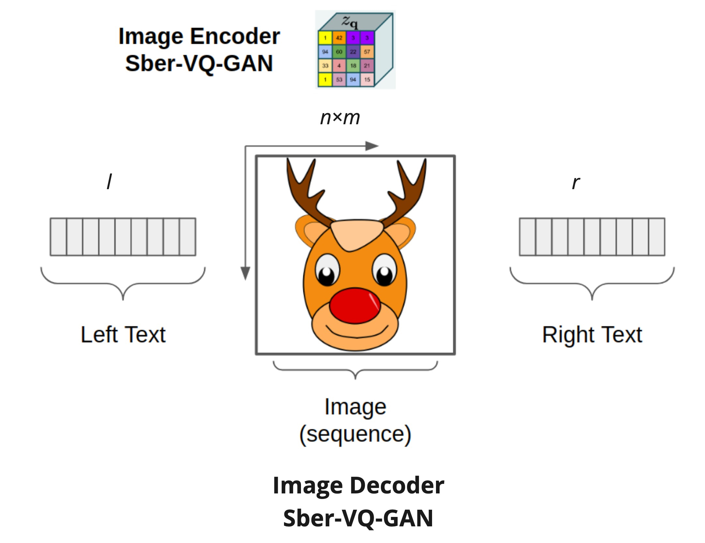
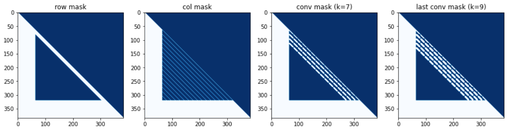
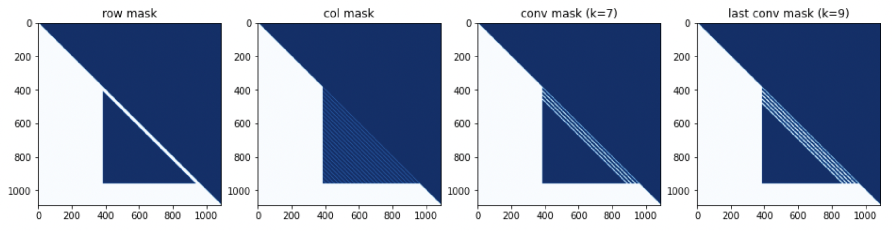

[[Colab]](https://colab.research.google.com/drive/1gmTDA13u709OXiAeXWGm7sPixRhEJCga?usp=sharing)


##  RUDOLPH 🦌🎄☃️

*One Hyper-Tasking Transformer can be creative as DALL-E and GPT-3 and smart as CLIP*

---

**RU**ssian **D**ecoder **O**n **L**anguage **P**icture **H**yper-tasking (**RUDOLPH**) is a text-image-text transformer designed for an easy fine-tuning for a range of tasks: from generating images by text description and image classification to visual question answering and more. This model demonstrates the power of Hyper-tasking Transformers.

*Hyper-tasking model is a generalized multi-tasking model, i.e., the model that can solve almost all tasks within supported modalities, mandatory including mutual pairwise translations between modalities (two modalities in case of RUDOLPH: images and Russian texts).*



# Models
+ [350M (RUDOLPH)](https://huggingface.co/sberbank-ai/RUDOLPH-350M)
+ [1.3B (RUDOLPH)](https://huggingface.co/sberbank-ai/RUDOLPH-1.3B)
+ [2.7B (RUDOLPH)](https://huggingface.co/sberbank-ai/RUDOLPH-2.7B)
+ [2.7B_FBC2 (RUDOLPH-fine-tuned)](https://huggingface.co/sberbank-ai/RUDOLPH-2.7B-FBC2)

The following table shows the values of the parameters corresponding to different RUDOLPH versions.

|     | 350M | 1.3B | 2.7B |
|-----|------|------|------|
| _l_ | 64   | 128  | 384  |
| _r_ | 64   | 128  | 128  |
| _m_ | 16   | 32   | 24   |
| _n_ | 16   | 32   | 24   |

# Sparse Attention Mask

### 350M

`row - col - row - [last] conv`



### 1.3B

`row - col - row - [last] conv`


### 2.7B

`row - col - row - [last] conv`



# Installing
```
pip install rudolph==0.0.1rc10
```
# Usage and Fine-Tuning

Usage and fine-tuning examples for different versions of RUDOLPH can be found in jupyters folder.

# Citation

```
@misc{github2022ruDolph,
  title         = {RUDOLPH: One Hyper-Tasking Transformer can be creative as DALL-E and GPT-3 and smart as CLIP},
  author        = {AIRI},
  year          = {2022},
  howpublished  = {\url{https://github.com/ai-forever/ru-dolph}},
}
```

# Supported by

[](https://airi.net)
